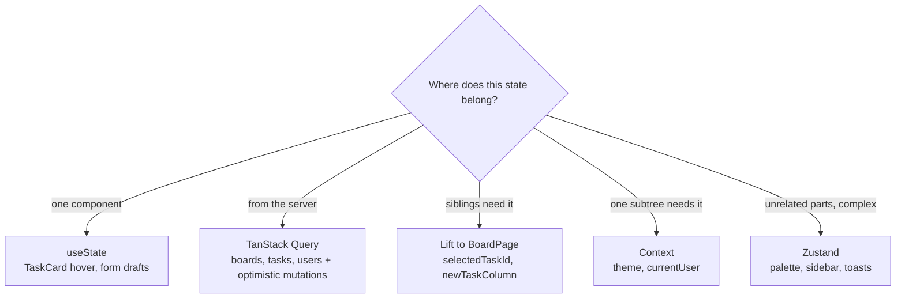
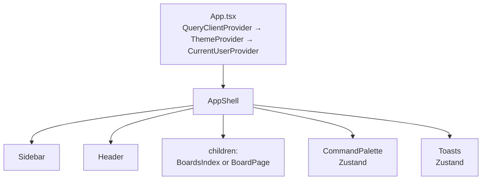

# TeamBoard — State Management at Scale

> _Not every state should be global._ This document maps each concept from the
> "State Management at Scale" decision tree to the exact place it's used in this codebase.

## The Decision Tree

---

## 1. Local State — `useState` ("Only one component needs it")

| File | State | Why it's local |
|---|---|---|
| `src/components/board/TaskCard.tsx` | `hovered` | Pure hover presentation — no other component cares |
| `src/components/board/TaskDetailPanel.tsx` | `title`, `description`, `commentDraft` | Form **drafts** — only committed to the server on blur/submit |
| `src/components/board/NewTaskModal.tsx` | `title`, `description`, `columnId`, `assigneeId`, `priority`, `dueDate` | The whole form dies with the modal |
| `src/components/CommandPalette.tsx` | `query`, `activeIndex` | Search text + keyboard highlight — only the palette renders them |

## 2. TanStack Query ("Data comes from the server")

All queries/mutations live in `src/hooks/useBoard.ts`:

- **Reads**
  - `useBoards()` → `Sidebar`, `BoardsIndex`
  - `useBoardDetail(id)` → `BoardPage`
  - `useUsers()` → `BoardPage`, `BoardsIndex`
- **Writes with optimistic updates** (`onMutate` → snapshot, `onError` → rollback, `onSettled` → re-sync)
  - `useMoveTask` → drag & drop in `KanbanBoard.tsx`
  - `useCreateTask` → `NewTaskModal.tsx`
  - `useUpdateTask` / `useDeleteTask` / `useAddComment` → `TaskDetailPanel.tsx`
- The "server" is faked in `src/api/client.ts` (in-memory data + simulated latency), so caching, loading states and rollback behave realistically.
- Bonus: `CommandPalette.tsx` peeks into the query **cache** (`queryClient.getQueryData`) to search tasks across boards without triggering refetches.

## 3. Lift State Up ("Several related components need it")

- `src/components/pages/BoardPage.tsx` owns **`selectedTaskId`**:
  - the Kanban grid needs it to highlight the active card,
  - the `TaskDetailPanel` needs it to know which task to show.
  - Neither sibling can own it alone → lifted to their closest common parent.
- Same file owns **`newTaskColumn`** — the "Add task" buttons live deep inside each `Column`, but the modal renders at page level.

## 4. Context ("Many components in one area need it")

- `src/context/ThemeContext.tsx` — `theme` is read by the whole tree (Header toggle, all styling via `data-theme` attribute).
- `src/context/CurrentUserContext.tsx` — `currentUser` is used by:
  - `Header` (mock account switcher),
  - `TaskDetailPanel` (comment author),
  - `NewTaskModal` (default assignee).

> In a real app the current user would come from auth; here it's mock data with a
> switcher so different identities are visible in the UI.

## 5. State Library — Zustand ("Many unrelated parts need complex client state")

All in `src/store/uiStore.ts`:

- **`paletteOpen`** — opened from the Header button *and* a global Ctrl+K listener in `CommandPalette.tsx`; unrelated triggers, one shared flag.
- **`sidebarOpen`** — toggled by `Sidebar`, affects the whole layout.
- **`toasts`** — a queue with auto-dismiss; fired from *every* mutation (move, create, delete, comment) across unrelated components, rendered once in `Toasts.tsx`.

---

## App Composition

## The Key Lesson

**Server data never goes into Context or Zustand.** It lives in TanStack Query's
cache — you get caching, background refetching, invalidation and optimistic
updates for free. The global store holds only *client* UI state, and Context is
reserved for values that are genuinely needed by a whole subtree (theme, session).
